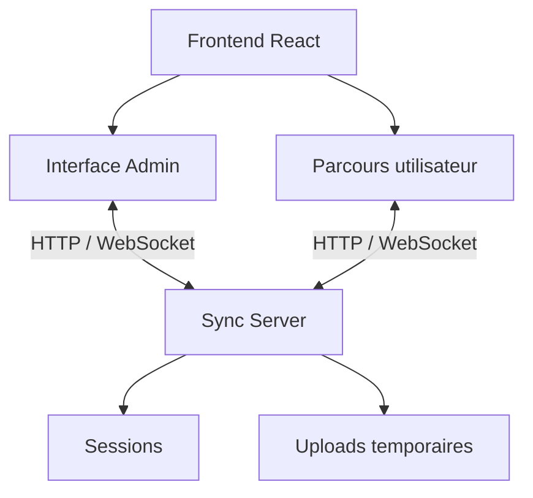
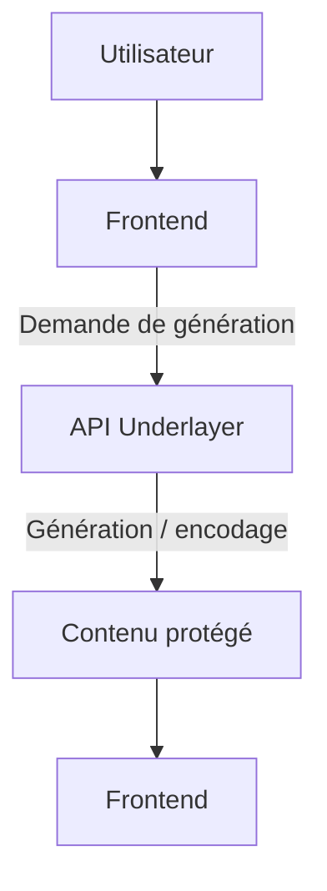
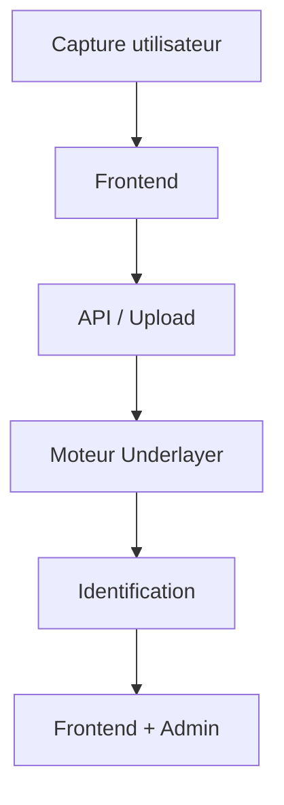
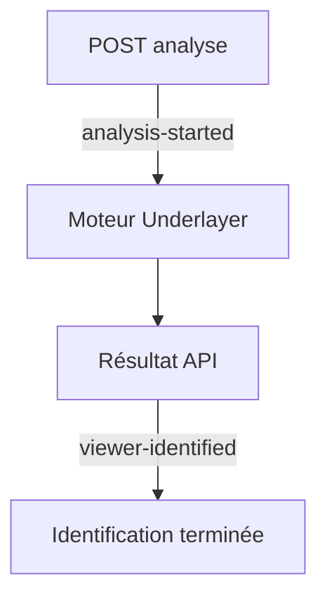
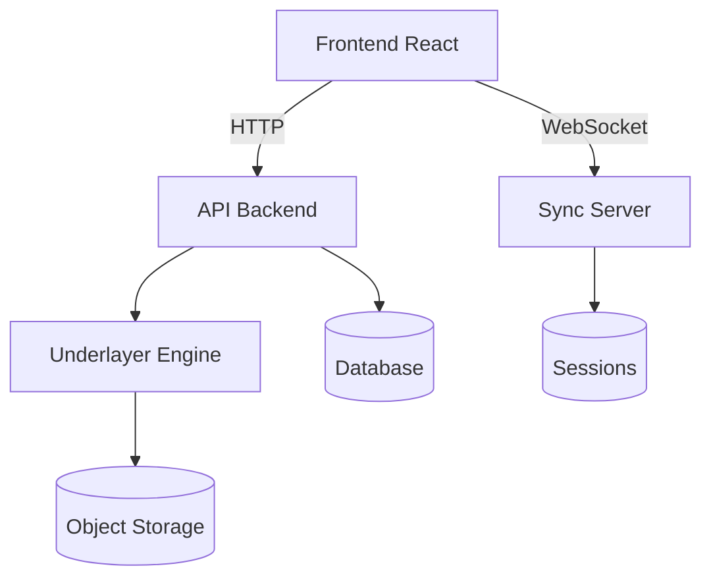

# Underlayer Demo

Démonstration interactive d'un parcours de protection et d'identification de contenu numérique.

Cette application permet à un utilisateur de parcourir de manière autonome une démonstration Underlayer : création d'une identité, réception d'un contenu protégé, capture du contenu, envoi de la capture pour analyse et identification de sa source.

Une interface d'administration permet en parallèle de superviser les sessions et leur progression en temps réel.

---

## Fonctionnalités

### Parcours utilisateur

- Création d'une identité pour la session
- Préparation et réception d'un contenu protégé
- Affichage plein écran du contenu
- Parcours guidé entre les phases Viewer et Creator
- Envoi d'une capture d'écran
- Analyse de la capture
- Identification de la source
- Redémarrage de la démonstration
- Interface responsive
- Interface disponible en français et en anglais

### Administration

- Création de sessions de démonstration
- Génération d'un QR code et d'un lien de partage
- Supervision des sessions actives
- Suivi en temps réel de la progression
- Visualisation de la capture envoyée
- Affichage de l'utilisateur identifié
- Fermeture d'une session

---

## Architecture

L'application est composée d'un frontend React et d'un serveur Node.js chargé de la gestion des sessions, des uploads et de la synchronisation temps réel.



Les événements WebSocket permettent notamment à l'administration de suivre immédiatement l'évolution d'une session utilisateur.

## Installation avec Docker

Docker est la méthode la plus simple pour lancer l'ensemble de l'application.

### Prérequis

- Docker
- Docker Compose

Clonez le projet :

```
git clone https://github.com/AlBlanchard/underlayer-demo.git
cd underlayer-demo
```

Construisez et démarrez l'application :

```
docker compose up --build
```

Une fois les conteneurs démarrés :

```
Frontend     http://localhost:8080
Sync Server  http://localhost:3000
```

L'administration est disponible sur :

```
http://localhost:8080/admin
```

Quelques commandes utiles :

```
# Lancer en arrière-plan
docker compose up -d --build

# Consulter les logs
docker compose logs -f

# Arrêter l'application
docker compose down
```

---

## Installation sans Docker

Les deux applications peuvent également être lancées séparément.

### Frontend

```
npm ci
npm run dev
```

### Sync Server

Dans un second terminal :

```
cd sync-server
npm ci
npm run dev
```

Le Sync Server écoute par défaut sur le port `3000`.

---

## Variables d'environnement

En développement, le frontend utilise les variables suivantes :

```
VITE_DEMO_SYNC_URL=ws://localhost:3000
VITE_DEMO_API_URL=http://localhost:3000
```

- `VITE_DEMO_SYNC_URL` définit l'adresse du serveur WebSocket.
- `VITE_DEMO_API_URL` définit l'adresse de l'API utilisée notamment pour les sessions et les uploads.

Les variables `VITE_*` sont intégrées au frontend lors du build Vite.

## Passage de la démo à une API complète

L'application a été conçue de manière à séparer l'interface, les services d'accès aux données et les données simulées utilisées pour la démonstration.

Les données mockées permettent actuellement d'exécuter l'intégralité du parcours sans dépendre de l'infrastructure Underlayer définitive.

Pour connecter la démonstration à une API réelle, les principaux points d'intégration se trouvent dans :

```text
src/

├── mocks/

│ ├── config.ts

│ └── demo.mock.ts

│

└── services/

├── demo.service.ts

├── demo-sync.service.ts

├── demo-upload.service.ts

└── demo-url.service.ts
```

### 1. Désactiver les données mockées

La configuration des données simulées est centralisée dans :

```text
src/mocks/config.ts
```

Les implémentations de démonstration se trouvent principalement dans :

```text
src/mocks/demo.mock.ts
```

Lors du branchement au backend réel, les données et temporisations simulées peuvent être supprimées ou désactivées au profit des appels API correspondants.

L'objectif est de conserver les composants React indépendants de la provenance des données : les composants continuent d'utiliser les hooks et services existants, tandis que leur implémentation communique avec l'API réelle.

### 2. Remplacer les opérations simulées

Le point d'entrée principal pour les opérations liées à la démonstration est :

```text
src/services/demo.service.ts
```

Les opérations actuellement simulées doivent être remplacées par leurs équivalents HTTP.

Par exemple :

```ts
const response = await fetch(`${API_URL}/demo/...`, {
  method: 'POST',

  headers: {
    'Content-Type': 'application/json',
  },

  body: JSON.stringify(data),
});

if (!response.ok) {
  throw new Error('Unable to process demo request.');
}

return response.json();
```

Les composants et hooks ne devraient pas appeler directement `fetch`. Les appels réseau restent centralisés dans les services afin de conserver la séparation actuelle des responsabilités.

### 3. Connecter la génération du contenu protégé

La phase de préparation du contenu utilise actuellement les données prévues pour la démonstration.

Pour utiliser le moteur Underlayer réel, cette étape devra appeler l'API chargée de générer ou récupérer le contenu protégé.

Le flux cible devient alors :



Le frontend peut conserver ses états actuels de préparation et de progression pendant le traitement de l'API.

### 4. Connecter l'analyse des captures

L'upload HTTP est isolé dans :

```text
src/services/demo-upload.service.ts
```

Le Sync Server gère actuellement la réception et le stockage temporaire de la capture.

Dans une intégration complète, l'étape suivante consiste à transmettre cette capture au véritable moteur d'analyse Underlayer.

Le flux cible est :



Le résultat retourné par l'API remplace alors l'identification simulée utilisée par la démonstration.

### 5. Conserver la synchronisation WebSocket

La synchronisation temps réel est déjà séparée dans :

```text
src/services/demo-sync.service.ts
```

et côté serveur dans :

```text
sync-server/src/websocket/WebSocketHub.ts
```

Les événements actuels peuvent être conservés :

```text
viewer-connected

encoding-started

content-ready

creator-phase-entered

screenshot-uploaded

analysis-started

viewer-identified

session-restarted

session-closed
```

Lors du passage à l'API réelle, les événements correspondant aux traitements simulés devront simplement être déclenchés à partir des résultats réels du backend.

Par exemple :



Cette approche permet de conserver l'interface Admin et le parcours utilisateur sans modifier leur fonctionnement général.

### 6. Remplacer le stockage temporaire

Les captures sont actuellement enregistrées temporairement par :

```text
sync-server/src/uploads/UploadService.ts
```

et leur cycle de vie est géré par :

```text
sync-server/src/uploads/UploadCleaner.ts
```

Pour un environnement persistant, ce stockage peut être remplacé par un stockage objet ou un service de fichiers adapté à l'infrastructure cible.

`UploadService` constitue le point naturel pour effectuer ce remplacement sans déplacer la logique de stockage dans `DemoServer`.

### 7. Ajouter la persistance des sessions

Les sessions sont actuellement conservées en mémoire dans :

```text
sync-server/src/sessions/DemoSessionStore.ts
```

Cela est suffisant pour la démonstration mais implique la perte des sessions lors d'un redémarrage du serveur.

Pour une utilisation persistante, `DemoSessionStore` peut être remplacé ou adapté pour communiquer avec une base de données.

L'interface de démonstration et les communications WebSocket peuvent ainsi rester inchangées pendant que la stratégie de persistance évolue.

### Architecture cible

Le passage en production peut ainsi se faire progressivement :



La séparation actuelle entre composants, hooks, services et serveur permet de remplacer progressivement les éléments simulés sans réécrire le parcours utilisateur.

### Checklist de migration

Avant de considérer la démonstration comme connectée à l'infrastructure réelle :

- [ ] Désactiver ou supprimer `src/mocks/`
- [ ] Remplacer les traitements simulés de `demo.service.ts`
- [ ] Connecter la génération du contenu protégé
- [ ] Connecter l'analyse réelle des captures
- [ ] Mapper les réponses API vers les types TypeScript existants
- [ ] Déclencher les événements WebSocket à partir des traitements réels
- [ ] Ajouter la gestion des erreurs et timeouts API
- [ ] Remplacer le stockage temporaire si une persistance est nécessaire
- [ ] Ajouter une persistance des sessions si nécessaire
- [ ] Configurer les URLs et secrets propres à l'environnement cible
- [ ] Tester le parcours complet Admin → utilisateur → analyse → résultat

### Features possibles

Plusieurs évolutions peuvent être envisagées :

- authentification de l'interface Admin ;

- historique des démonstrations ;

- monitoring et observabilité ;

- persistance des sessions.
